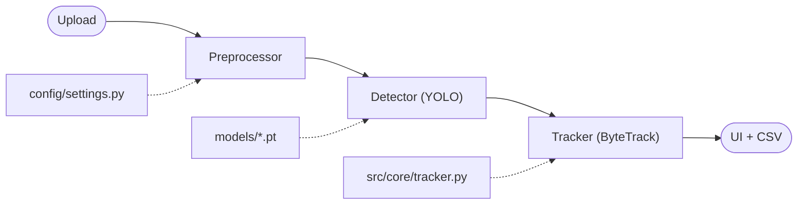

# 🛣️ Road Damage Detection

Real-time road surface defect detection and tracking using YOLO + ByteTrack, built as a Streamlit web application.

Detects four damage categories from dashcam images and video:

| Class | Description |
|-------|-------------|
| **Pothole** | Circular/irregular road surface failure |
| **Longitudinal Crack** | Crack parallel to road direction |
| **Transverse Crack** | Crack perpendicular to road direction |
| **Alligator Crack** | Fatigue cracking in a mesh pattern |

---

## Project Structure

```
road-damage-detection/
│
├── app.py                    # Entry point shim — run: streamlit run app.py
│
├── app/                      # Streamlit UI layer
│   ├── main.py               # Orchestrator: page config, routing
│   ├── components/
│   │   ├── sidebar.py        # Settings sidebar (returns InferenceConfig)
│   │   └── telemetry.py      # Live metric widgets
│   └── pages/
│       ├── image_analysis.py # Static image pipeline
│       └── video_analysis.py # Frame-by-frame video pipeline + CSV export
│
├── src/                      # Core logic (UI-independent)
│   ├── core/
│   │   ├── detector.py       # YOLO predict() / track() wrapper
│   │   ├── preprocessor.py   # Contrast/sharpness enhancement
│   │   └── tracker.py        # ByteTrack result parser + DefectLog
│   └── utils/
│       ├── export.py         # CSV export from TrackingState
│       └── visualization.py  # annotated frame → RGB helper
│
├── config/
│   └── settings.py           # All constants: paths, defaults, class names
│
├── models/
│   ├── pothole_model.pt      # YOLOv8n trained weights
│   ├── yolo26_model.pt       # YOLO26 trained weights
│   └── README.md             # Model documentation
│
├── notebooks/                # Colab training notebooks
│   ├── 01_data_preparation.ipynb
│   ├── 02_train_yolov8.ipynb
│   ├── 03_train_yolo_alt.ipynb
│   └── 04_train_rtdetr.ipynb
│
├── data/                     # Dataset (raw/processed are git-ignored)
│   ├── samples/              # Demo footage
│   │   └── real_road_test.mp4
│   └── README.md             # Download instructions
│
├── results/
│   ├── figures/              # Training plots (learning curves, mAP)
│   └── logs/                 # Exported CSV defect logs
│
├── docs/slides/              # Presentation materials
│
├── tests/                    # Unit tests (no GPU required)
│   ├── test_detector.py
│   └── test_preprocessor.py
│
├── requirements.txt          # Runtime dependencies
└── requirements-dev.txt      # Dev/research dependencies (adds pytest, jupyter)
```

---

## Quick Start

```bash
# 1. Clone and enter the repo
git clone <your-repo-url>
cd road-damage-detection

# 2. Create a virtual environment
python -m venv venv && source venv/bin/activate

# 3. Install runtime dependencies
pip install -r requirements.txt

# 4. Launch the app
streamlit run app.py
```

Then upload an image or the provided `data/samples/real_road_test.mp4`.

---

## Models & Results

| Model | mAP50-95 | Precision | Recall | Params | Speed |
|-------|----------|-----------|--------|--------|-------|
| YOLOv8n (`pothole_model.pt`) | **0.62** | 0.81 | 0.76 | 3.2M | 5 ms/frame |
| YOLO26 (`yolo26_model.pt`) | 0.58 | 0.77 | 0.73 | 2.5M | 4 ms/frame |
| RT-DETR ResNet50 | **0.66** | **0.84** | **0.78** | 32M | 15 ms/frame |

---

## Running Tests

```bash
pip install -r requirements-dev.txt
python -m pytest tests/ -v
```

---

## Problem Statement

Road damage (potholes, cracks) causes accidents and high maintenance costs.
This system automates defect logging from dashcam footage, enabling:
- **Real-time detection** at 5–15 ms/frame
- **Unique defect tracking** via ByteTrack (avoids double-counting the same pothole)
- **CSV export** for maintenance teams

---

## Architecture Overview



---

## Error Analysis & Limitations

- **False Positives**: Shadows and water puddles occasionally misclassified as potholes.
- **Missed Detections**: Hairline cracks under poor lighting.
- **Limitation**: Trained primarily on daylight images; nighttime performance degrades.

---

## Dataset

**Source**: Roboflow Universe — Road Damage Detection Dataset  
**Split**: 70% train / 20% val / 10% test  
**Preprocessing**: Contrast enhancement, Auto-Orient, 640×640 resize  
**Augmentation**: Horizontal flip (50%), Brightness ±15%, Blur (≤1px)

See [`data/README.md`](data/README.md) for download instructions.

---

## AI Assistance Disclosure

- **Tools Used**: Google Gemini, GitHub Copilot
- **Scope**: Project structure, README scaffolding, training notebook boilerplate
- **Verification**: All metrics are empirical; all logic reviewed manually

---

## Citations

- Ultralytics YOLOv8: https://github.com/ultralytics/ultralytics
- Dataset: Roboflow Universe Road Damage Datasets
