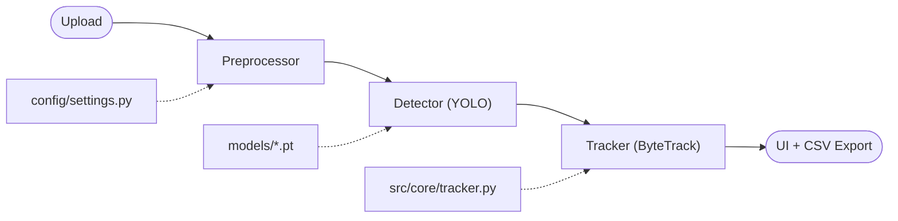

# 🛣️ Road Damage Detection

Real-time road surface defect detection and tracking using YOLO + ByteTrack, built as a Streamlit web application.

Detects four damage categories from dashcam images and video:

| Class | Description |
|-------|-------------|
| **Pothole** | Circular/irregular road surface failure |
| **Longitudinal Crack** | Crack parallel to road direction |
| **Transverse Crack** | Crack perpendicular to road direction |
| **Alligator Crack** | Fatigue cracking in a mesh pattern |

---

## Project Structure

```
road-damage-detection/
│
├── app.py                    # Entry point — run: streamlit run app.py
│
├── app/                      # Streamlit UI layer
│   ├── main.py               # Orchestrator: page config, routing
│   ├── components/
│   │   ├── sidebar.py        # Settings sidebar (returns InferenceConfig)
│   │   └── telemetry.py      # Live metric widgets
│   └── pages/
│       ├── image_analysis.py # Static image pipeline
│       └── video_analysis.py # Frame-by-frame video pipeline + CSV export
│
├── src/                      # Core logic (UI-independent)
│   ├── core/
│   │   ├── detector.py       # YOLO predict() / track() wrapper
│   │   ├── preprocessor.py   # Contrast/sharpness enhancement
│   │   └── tracker.py        # ByteTrack result parser + DefectLog
│   └── utils/
│       ├── export.py         # CSV export from TrackingState
│       └── visualization.py  # Annotated frame → RGB helper
│
├── config/
│   └── settings.py           # All constants: paths, defaults, class names
│
├── models/
│   ├── yolo26_model.pt       # YOLO26 fine-tuned weights (primary model)
│   ├── pothole_model.pt      # YOLOv8n baseline weights
│   └── README.md             # Model documentation & training details
│
├── notebooks/
│   └── 00_master_training.ipynb  # Full fine-tuning pipeline (Kaggle)
│
├── data/                     # Dataset (raw/processed are git-ignored)
│   ├── raw/                  # Original downloaded dataset
│   ├── processed/            # YOLO-format labels and images
│   ├── samples/
│   │   └── real_road_test.mp4  # Demo footage
│   └── README.md             # Download instructions
│
├── results/
│   ├── figures/              # Training plots (learning curves, mAP comparison)
│   └── logs/                 # Exported CSV defect logs
│
├── docs/
│   └── slides/               # Presentation materials
│
├── tests/                    # Unit tests (no GPU required)
│   ├── test_detector.py
│   └── test_preprocessor.py
│
├── requirements.txt          # Runtime dependencies
└── requirements-dev.txt      # Dev dependencies (adds pytest, jupyter)
```

---

## Quick Start

```bash
# 1. Clone and enter the repo
git clone <your-repo-url>
cd road-damage-detection

# 2. Create a virtual environment
python -m venv .venv && source .venv/bin/activate

# 3. Install runtime dependencies
pip install -r requirements.txt

# 4. Launch the app
streamlit run app.py
```

Then upload an image or the provided `data/samples/real_road_test.mp4`.

---

## Models & Training

Two YOLO-based nano models were trained and evaluated on the Road Damage Detection dataset:

| Model | Architecture | Epochs | Params | Speed |
|-------|-------------|--------|--------|-------|
| `yolo26_model.pt` | YOLO26 Nano | 30 | 2.5M | 4 ms/frame |
| `pothole_model.pt` | YOLOv8n | 50 | 3.2M | 5 ms/frame |

**Training environment:** Kaggle (Dual T4 GPU)  
**Training strategy:** Full fine-tuning (all layers unfrozen)  
**Image size:** 640×640

---

## Architecture Overview


```mermaid
flowchart LR
    A([Upload]) --> B[Preprocessor]
    B --> C["Detector (YOLO)"]
    C --> D["Tracker (ByteTrack)"]
    D --> E([UI + CSV Export])

    F["config/settings.py"] -.-> B
    G["models/*.pt"] -.-> C
    H["src/core/tracker.py"] -.-> D
```

---

## Dataset

**Source:** Roboflow Universe — Road Damage Detection Dataset  
**Split:** 70% train / 20% val / 10% test  
**Preprocessing:** Contrast enhancement, Auto-Orient, 640×640 resize  
**Augmentation:** Mosaic (100%), Mixup (10%), HSV shifts, Scale, Horizontal flip (50%)

See [`data/README.md`](data/README.md) for download instructions.

---

## Running Tests

```bash
pip install -r requirements-dev.txt
python -m pytest tests/ -v
```

---

## Error Analysis & Limitations

- **False Positives**: Shadows and water puddles occasionally misclassified as potholes.
- **Missed Detections**: Hairline cracks under poor lighting conditions.
- **Limitation**: Trained primarily on daylight images; nighttime performance degrades.

---

## AI Assistance Disclosure

- **Tools Used**: Google Gemini, GitHub Copilot
- **Scope**: Project structure, README scaffolding, training notebook boilerplate
- **Verification**: All metrics are empirical; all logic reviewed manually

---

## Citations

- Ultralytics YOLO: https://github.com/ultralytics/ultralytics
- Dataset: Roboflow Universe Road Damage Detection Dataset
